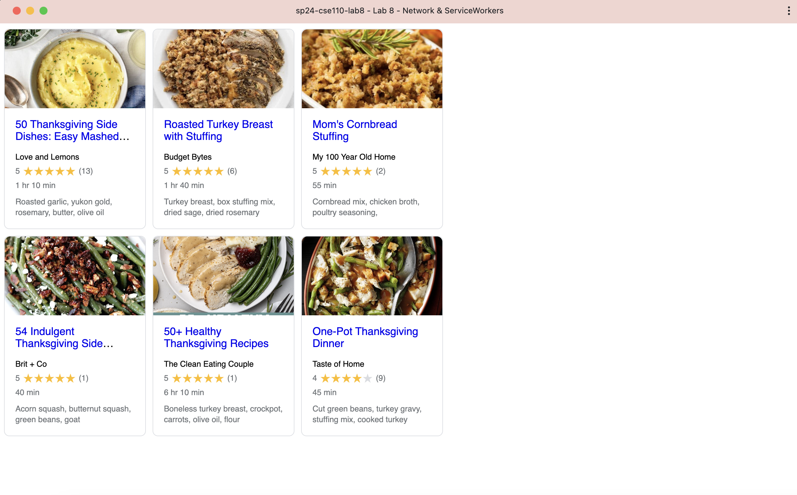

# Lab 8 - Anna Lee
https://annamlee.github.io/sp24-cse110-lab8/

Graceful degradation and service workers are related because service workers help implement graceful degradation by enabling offline capabilities and improving performance during scenarios where the user may not have stable or fast internet. When service workers are not supported, the application gracefully degrades into a fully online version while still maintaining all core functionalities.

